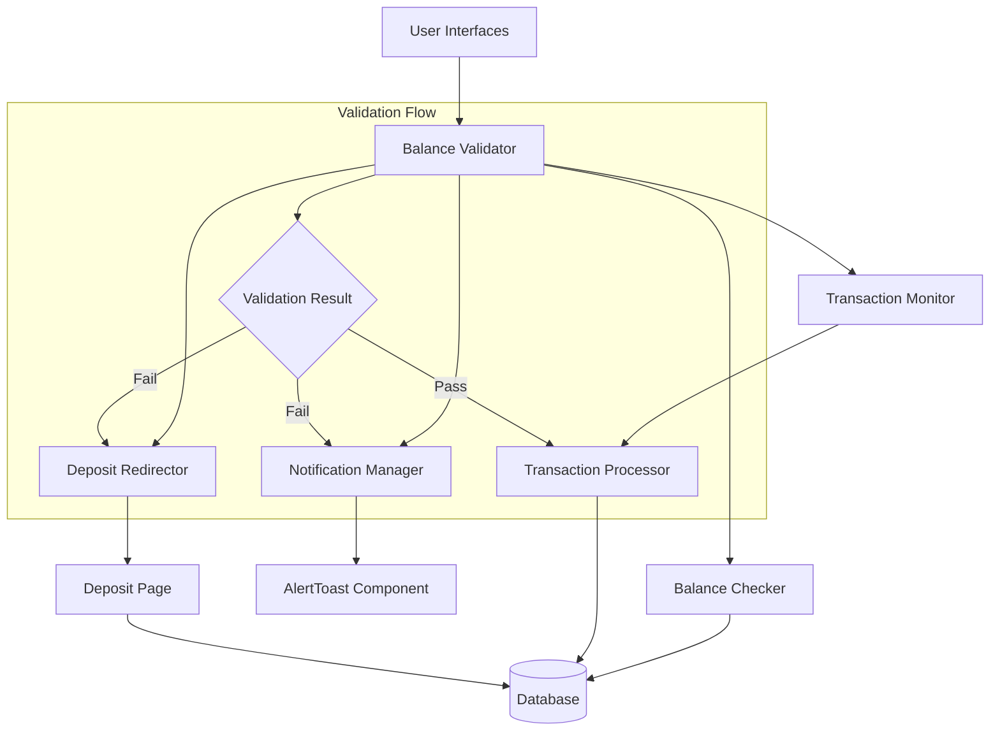
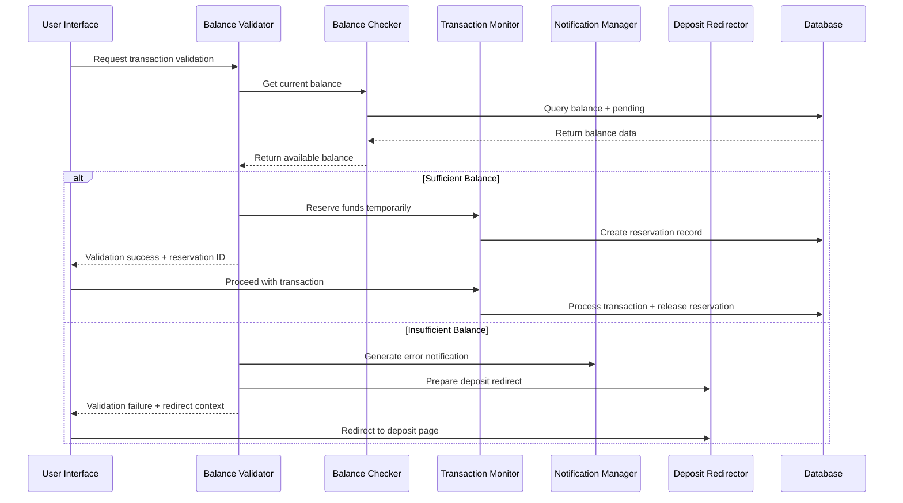

# Design Document

## Overview

The Balance Validation System is a comprehensive validation layer that ensures users have sufficient funds before executing transactions within the Tesla CapX platform. The system operates as middleware between user interfaces and transaction processing, providing real-time balance validation, automatic deposit redirection, and consistent notification handling across all transaction types including withdrawals, investment plan purchases, car orders, and VIP memberships.

The system follows a centralized validation approach with modular components that integrate seamlessly with the existing Next.js and Prisma-based architecture. The design prioritizes performance, security, and user experience through server-side validation, intelligent caching, and graceful error handling.

## Architecture

### System Architecture Overview



### Component Architecture

The Balance Validation System consists of five core components:

1. **Balance_Validator**: Central orchestration component that coordinates validation workflow
2. **Balance_Checker**: Service for retrieving and caching user balance data
3. **Transaction_Monitor**: Middleware that intercepts transaction attempts for validation
4. **Notification_Manager**: Handles user notifications and error messaging
5. **Deposit_Redirector**: Manages redirection flow to deposit page with context preservation

### Integration Points

The system integrates with existing Tesla CapX components:

- **Prisma Database**: Uses existing User and Transaction models
- **Next.js API Routes**: Extends existing transaction endpoints
- **AlertToast Component**: Leverages existing notification system
- **Authentication System**: Integrates with existing NextAuth session management
- **Transaction Processing**: Enhances existing order/plan/withdrawal flows

## Components and Interfaces

### Balance_Validator Component

**Purpose**: Central coordinator for all balance validation operations

**Interface**:
```typescript
interface BalanceValidator {
  validateWithdrawal(userId: string, amount: number): Promise<ValidationResult>
  validatePlanPurchase(userId: string, planCost: number): Promise<ValidationResult>
  validateCarOrder(userId: string, vehiclePrice: number): Promise<ValidationResult>
  validateVipPurchase(userId: string, membershipCost: number): Promise<ValidationResult>
  validateTransaction(userId: string, amount: number, type: TransactionType): Promise<ValidationResult>
}

interface ValidationResult {
  isValid: boolean
  currentBalance: number
  requiredAmount: number
  shortfall?: number
  errorMessage?: string
  canRedirect: boolean
}
```

**Responsibilities**:
- Coordinate validation workflow across components
- Determine validation rules based on transaction type
- Aggregate validation results for client consumption
- Handle minimum balance thresholds and business rules

### Balance_Checker Service

**Purpose**: Retrieve, cache, and verify user balance data

**Interface**:
```typescript
interface BalanceChecker {
  getCurrentBalance(userId: string): Promise<number>
  getAvailableBalance(userId: string): Promise<number>
  refreshBalanceCache(userId: string): Promise<void>
  calculatePendingTransactions(userId: string): Promise<number>
}
```

**Responsibilities**:
- Query database for current user balance
- Calculate available balance accounting for pending transactions
- Implement caching strategy (30-second TTL)
- Handle edge cases (negative balances, null values)

**Caching Strategy**:
- Redis-like in-memory cache for balance data
- 30-second expiration with background refresh
- Cache invalidation on balance-affecting operations

### Transaction_Monitor Component

**Purpose**: Middleware that intercepts and validates transaction attempts

**Interface**:
```typescript
interface TransactionMonitor {
  interceptTransaction(request: TransactionRequest): Promise<InterceptResult>
  reserveFunds(userId: string, amount: number, duration: number): Promise<ReservationId>
  releaseFunds(reservationId: ReservationId): Promise<void>
  trackValidationAttempt(userId: string, type: TransactionType, result: ValidationResult): Promise<void>
}

interface TransactionRequest {
  userId: string
  type: TransactionType
  amount: number
  metadata: Record<string, any>
}
```

**Responsibilities**:
- Intercept API requests before transaction processing
- Implement temporary fund reservation during validation
- Log validation attempts for audit and security
- Rate limiting (10 validations per minute per user)

### Notification_Manager Component

**Purpose**: Handle user notifications and error messaging

**Interface**:
```typescript
interface NotificationManager {
  showSuccessNotification(message: string): void
  showInsufficientBalanceError(currentBalance: number, requiredAmount: number, shortfall: number): void
  showWarningNotification(message: string): void
  showValidationError(error: string): void
  formatCurrency(amount: number): string
}
```

**Responsibilities**:
- Generate consistent error messages with formatted amounts
- Integrate with existing AlertToast component
- Handle success, warning, and error notification types
- Provide currency formatting utilities

**Message Templates**:
- Insufficient Balance: "You need $X but your balance is $Y. Please deposit $Z more."
- Low Balance Warning: "Your balance will be $X after this transaction."
- Validation Error: "Unable to verify balance. Please try again."

### Deposit_Redirector Component

**Purpose**: Handle redirection to deposit page with context preservation

**Interface**:
```typescript
interface DepositRedirector {
  redirectToDeposit(context: RedirectionContext): Promise<void>
  calculateSuggestedDeposit(shortfall: number): number
  preserveTransactionContext(context: TransactionContext): string
  restoreTransactionContext(contextId: string): TransactionContext
}

interface RedirectionContext {
  userId: string
  transactionType: TransactionType
  originalAmount: number
  shortfall: number
  returnUrl: string
  metadata: Record<string, any>
}
```

**Responsibilities**:
- Generate return URLs with transaction context
- Calculate suggested deposit amounts (shortfall + buffer)
- Store and retrieve transaction context across navigation
- Handle deep linking back to original transaction

## Data Models

### Extended User Model

The existing Prisma User model supports the balance validation system:

```typescript
// Existing User model (no changes required)
model User {
  id            String  @id @default(uuid())
  balance       Float   @default(0.0)
  // ... other existing fields
}
```

### New BalanceValidation Model

```typescript
model BalanceValidation {
  id              String    @id @default(uuid())
  userId          String
  transactionType String    // "WITHDRAWAL", "PLAN_PURCHASE", "CAR_ORDER", "VIP_PURCHASE"
  amount          Float
  balanceAtTime   Float
  result          String    // "PASS", "FAIL", "ERROR"
  shortfall       Float?
  metadata        Json?
  createdAt       DateTime  @default(now())
  
  user User @relation(fields: [userId], references: [id])
  
  @@index([userId, createdAt])
  @@index([transactionType, createdAt])
}
```

### Extended Transaction Model

The existing Transaction model requires minimal enhancement:

```typescript
// Enhanced existing model
model Transaction {
  // ... existing fields
  validationId String? // Reference to BalanceValidation record
  
  validation BalanceValidation? @relation(fields: [validationId], references: [id])
}
```

### New FundReservation Model

```typescript
model FundReservation {
  id         String    @id @default(uuid())
  userId     String
  amount     Float
  purpose    String    // "PLAN_VALIDATION", "ORDER_VALIDATION", etc.
  expiresAt  DateTime
  releasedAt DateTime?
  createdAt  DateTime  @default(now())
  
  user User @relation(fields: [userId], references: [id])
  
  @@index([userId, expiresAt])
  @@index([expiresAt])
}
```

## API Specifications

### Balance Validation API Endpoints

#### POST /api/balance/validate

Validate user balance for a specific transaction type.

**Request**:
```typescript
{
  transactionType: "WITHDRAWAL" | "PLAN_PURCHASE" | "CAR_ORDER" | "VIP_PURCHASE"
  amount: number
  metadata?: Record<string, any>
}
```

**Response**:
```typescript
{
  success: boolean
  validation: {
    isValid: boolean
    currentBalance: number
    requiredAmount: number
    shortfall?: number
    canProceed: boolean
  }
  message?: string
  redirectUrl?: string
}
```

#### GET /api/balance/current

Retrieve current user balance with pending transactions.

**Response**:
```typescript
{
  balance: number
  availableBalance: number
  pendingReservations: number
  lastUpdated: string
}
```

#### POST /api/balance/reserve

Reserve funds temporarily during validation process.

**Request**:
```typescript
{
  amount: number
  purpose: string
  durationMinutes?: number // default: 5
}
```

**Response**:
```typescript
{
  success: boolean
  reservationId: string
  expiresAt: string
}
```

#### DELETE /api/balance/reserve/:reservationId

Release previously reserved funds.

**Response**:
```typescript
{
  success: boolean
  message: string
}
```

### Enhanced Transaction API Endpoints

#### Modified Existing Endpoints

All existing transaction endpoints (orders, plans, withdrawals, vip) will be enhanced with balance validation middleware:

1. **Pre-validation**: Check balance before processing
2. **Fund reservation**: Reserve funds during transaction
3. **Validation logging**: Track all validation attempts
4. **Consistent error handling**: Standardized insufficient balance responses

**Enhanced Response Format** (for insufficient balance):
```typescript
{
  error: "Insufficient balance"
  message: "You need $1,500 but your balance is $800. Please deposit $700 more."
  insufficientBalance: true
  currentBalance: 800
  requiredAmount: 1500
  shortfall: 700
  suggestedDeposit: 750 // shortfall + 50 buffer
  depositUrl: "/dashboard/deposit?context=abc123"
}
```

## Implementation Details

### Validation Workflow



### Error Handling Strategy

1. **Graceful Degradation**: Assume insufficient balance on system errors
2. **Timeout Handling**: 5-second maximum for validation operations
3. **Retry Logic**: Exponential backoff for transient database errors
4. **Audit Logging**: Log all validation attempts and system errors
5. **User Communication**: Clear, actionable error messages

### Security Considerations

1. **Server-Side Validation**: All balance checks occur on the server
2. **SQL Injection Prevention**: Parameterized queries throughout
3. **Rate Limiting**: 10 validation requests per minute per user
4. **Authentication Required**: All endpoints require valid session
5. **Audit Trail**: Complete logging of validation attempts and results

### Performance Optimizations

1. **Balance Caching**: 30-second TTL with background refresh
2. **Database Indexing**: Optimized queries on user balance operations
3. **Batch Operations**: Group multiple validations when possible
4. **Asynchronous Processing**: Non-blocking validation where appropriate
5. **Connection Pooling**: Efficient database connection management

### Currency Handling

1. **Precision**: Decimal arithmetic for financial calculations
2. **Formatting**: Consistent currency display using `toLocaleString()`
3. **Validation**: Server-side amount validation and sanitization
4. **Future-Proofing**: Architecture supports multi-currency expansion

## Correctness Properties

*A property is a characteristic or behavior that should hold true across all valid executions of a system-essentially, a formal statement about what the system should do. Properties serve as the bridge between human-readable specifications and machine-verifiable correctness guarantees.*

### Property 1: Universal Balance Validation

*For any* user and any transaction amount, the Balance_Validator should accept the transaction if and only if the user's available balance is greater than or equal to the transaction amount
**Validates: Requirements 1.1, 2.1, 3.1, 4.1**

### Property 2: Insufficient Balance Rejection

*For any* transaction where the required amount exceeds available balance, the Balance_Validator should reject the transaction and return an insufficient balance error with correct shortfall calculation
**Validates: Requirements 1.2, 2.2, 3.2, 7.2**

### Property 3: Minimum Threshold Enforcement

*For any* withdrawal request below the minimum threshold ($10.00), the Balance_Validator should reject the transaction regardless of available balance
**Validates: Requirements 1.3**

### Property 4: Low Balance Warning Generation

*For any* valid transaction that would leave the user's balance below $10.00, the system should display a warning message but allow the transaction to proceed
**Validates: Requirements 1.5**

### Property 5: Available Balance Calculation

*For any* user with pending transactions, the calculated available balance should equal the current balance minus the sum of all unreleased fund reservations
**Validates: Requirements 3.4, 6.4**

### Property 6: Fund Reservation Round-trip

*For any* valid fund reservation, reserving then immediately releasing funds should leave the user's available balance unchanged
**Validates: Requirements 2.3**

### Property 7: Context Preservation Round-trip

*For any* transaction context, storing the context during redirection and then restoring it should yield identical transaction details
**Validates: Requirements 5.2, 5.4**

### Property 8: Deposit Amount Calculation

*For any* insufficient balance scenario, the suggested deposit amount should equal the shortfall plus a reasonable buffer (minimum $50)
**Validates: Requirements 4.5, 5.3**

### Property 9: Currency Formatting Consistency

*For any* monetary amount in the system, the formatCurrency function should produce consistent formatting with 2 decimal places and proper thousand separators
**Validates: Requirements 7.4**

### Property 10: Decimal Arithmetic Precision

*For any* financial calculation in the system, the result should maintain exact decimal precision without floating-point errors
**Validates: Requirements 10.2, 10.3, 10.5**

### Property 11: Error Safety Default

*For any* system error or exception during validation, the Balance_Validator should default to rejecting the transaction as a safety measure
**Validates: Requirements 9.1, 9.5**

### Property 12: Authentication Requirement

*For any* balance validation request, the system should reject requests from unauthenticated users
**Validates: Requirements 12.2**

### Property 13: Audit Trail Completeness

*For any* validation attempt, the system should create a complete audit log entry containing user ID, timestamp, transaction type, amount, and result
**Validates: Requirements 8.4, 12.4**

## Error Handling

The Balance Validation System implements comprehensive error handling across all components:

**Database Connection Failures**:
- Graceful degradation with user-friendly error messages
- Automatic retry logic with exponential backoff
- Fallback to "insufficient balance" assumption for safety

**Validation Timeouts**:
- 5-second maximum timeout for all validation operations
- Clear timeout notifications to users
- Audit logging of timeout events for system monitoring

**Edge Case Handling**:
- Negative balance values treated as zero for validation
- Null or undefined balance values default to zero
- Invalid transaction amounts rejected with appropriate errors

**Concurrent Transaction Safety**:
- Optimistic locking for balance updates
- Fund reservation system prevents double-spending
- Real-time balance updates across user sessions

## Testing Strategy

The Balance Validation System employs a dual testing approach combining property-based testing for core validation logic with traditional unit and integration tests for system components.

### Property-Based Testing

**Framework**: fast-check (JavaScript/TypeScript property-based testing library)

**Configuration**:
- Minimum 100 iterations per property test
- Custom generators for financial data (balances, amounts, user scenarios)
- Shrinking enabled for minimal counterexample discovery

**Property Test Implementation**:
Each correctness property will be implemented as a property-based test with the following tag format:
```javascript
// Feature: balance-validation-system, Property 1: Universal Balance Validation
```

**Test Data Generation**:
- Balance values: $0.00 to $100,000.00 with realistic distribution
- Transaction amounts: $0.01 to $50,000.00 covering edge cases
- User scenarios: Various authentication and session states
- Edge cases: Negative values, null values, precision boundaries

### Unit Testing

**Component Tests**:
- Balance_Validator validation logic with mock dependencies
- Balance_Checker caching behavior and database interactions
- Notification_Manager message generation and formatting
- Deposit_Redirector context preservation and URL generation

**Integration Testing**:
- End-to-end transaction validation workflows
- Database model integration and data consistency
- Authentication and session management compatibility
- UI component integration with notification system

**Performance Testing**:
- Load testing with concurrent validation requests
- Cache performance and expiration behavior
- Database query optimization validation
- Response time requirements (< 500ms normal, < 2s maximum)

**Security Testing**:
- Authentication bypass attempt prevention
- SQL injection prevention in parameterized queries
- Rate limiting effectiveness (10 validations/minute/user)
- Server-side validation enforcement

### Integration Testing

1. **Unit Tests**: Individual component validation logic
2. **Integration Tests**: End-to-end transaction validation flows
3. **Performance Tests**: Load testing with concurrent validations
4. **Security Tests**: Validation bypass attempts and SQL injection
5. **User Experience Tests**: Complete user journey validation
